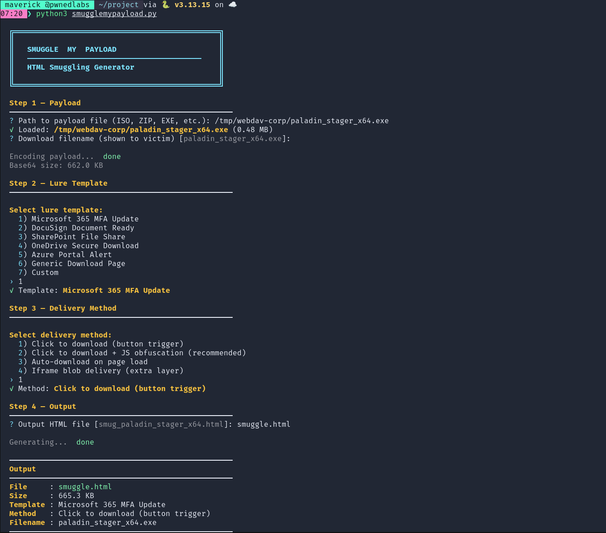
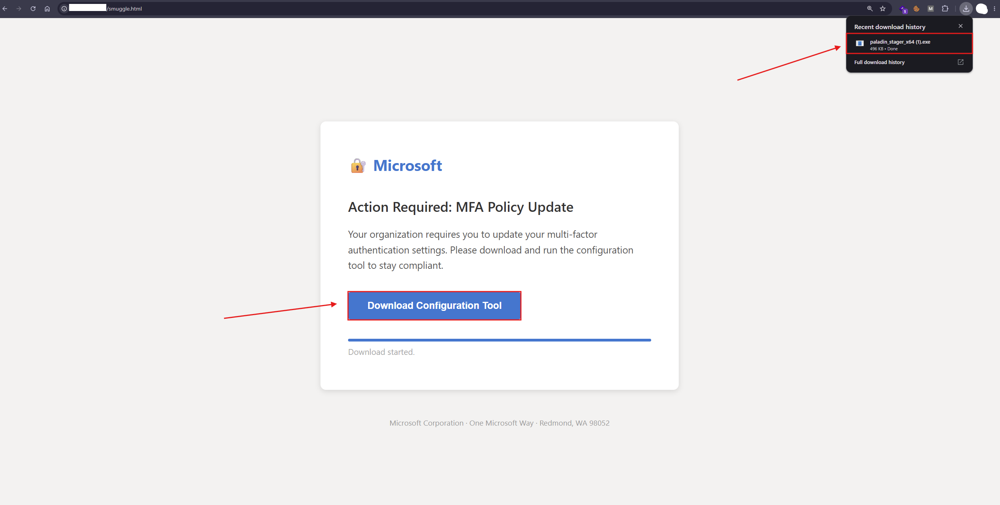

# SmuggleMyPayload

SmuggleMyPayload is an **HTML** Smuggling toolkit for generating **HTML** pages that embed and reconstruct files using JavaScript. It provides multiple **HTML** Smuggling methods, payload encoding options, JavaScript variations, and several built-in **HTML** templates.

## Features

- Multiple **HTML** Smuggling methods
- Multiple **HTML** templates
- Base64 payload encoding
- Payload chunking
- JavaScript-based file reconstruction
- JavaScript string obfuscation
- Randomized JavaScript variable names
- Automatic download functionality
- Iframe Blob delivery
- Custom **HTML** templates
- Custom page titles and branding
- Interactive **CLI**
- Command-line arguments
- No external Python dependencies

## Templates

- Microsoft **365** **MFA** Update
- DocuSign Document Ready
- SharePoint File Share
- OneDrive Secure Download
- Azure Portal Alert
- Generic Download Page
- Custom

## Delivery Mechanisms : 

- Click to Download + JavaScript Obfuscation
- Auto Download
- Iframe Blob Delivery

## Requirements

- Python 3.9+
- No external Python packages
- The tool only uses Python's standard library.

## Installation

Clone the repository:

```bash
git clone https://github.com/shaheeryasirofficial/SmuggleMyPayload
cd SmuggleMyPayload
cd Source
python3 SmuggleMyPayload.py
```

---

## Working



---

## Author

**Shaheer Yasir (Maverick)**
- **GitHub:** [@shaheeryasirofficial](https://github.com/shaheeryasirofficial)

---

## Acknowledgments & Credits

Special thanks and credits to:

- [Mgeeky](https://github.com/mgeeky) For his research and valuable contributions to HTML Smuggling techniques and offensive tooling.
- [White Knight Labs](https://whiteknightlabs.com/) For their training, research materials, and ongoing contributions to the offensive security community.
- [Lavender](https://github.com/Lavender-exe) For her support.

---

## Disclaimer

This tool is created for **educational and research purposes only**. It is not intended for production environments or unauthorized testing.

---

## License

This project is released under the MIT License. See the repository for full license details.
